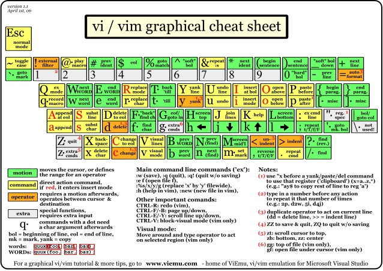
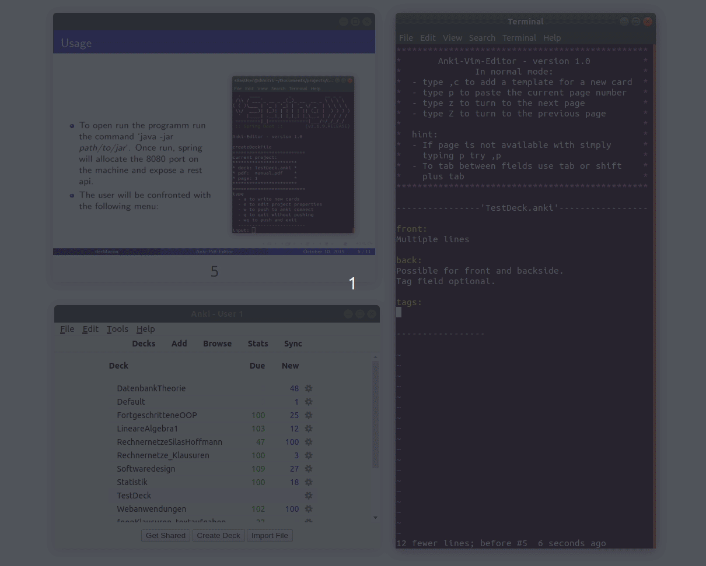

# Anki-Pdf-Editor
Commandline tool to create anki flash cards via the vim editor. Once started the programm will display a selected pdf document in which the user can navigate throughout vim itself. If a anki-card should contain a specific pdf page of the displayed document on either the front- or the backside of a note it can be passed in a simplyfied version where the pagenumber is written between tags. 

All features can be used via shortcuts. For that the program opens a costum [.vimrc](./editor/src/main/resources/com/dermacon/ankipdfeditor/.vimrc). For further information see the [manual](./otherDocs/manual-tex/manual.pdf).

## Shortcut overview

### Programm specific
* `z` / `Z`: turn next / previous page; Copy the current page tag to the default register (accessed via `p`)
* `]`: Append new card template to anki file
* `[`: paste the current page tag to cursor position
* *tab* / *shift* + *tab*: tab between fields

### vim default 


## Requirements
* Ankidroid 2.1 (or newer)
* AnkiConnect [addon](https://ankiweb.net/shared/info/2055492159)
* gnome-terminal ([terminal emulation](https://askubuntu.com/questions/684180/how-to-reinstall-gnome-terminal))
* unix os (Vim)

## Usage
* Download jar from release tab and execute via `java -jar ./path/to/jar`
* Recommended: execute in the same directory to avoid initializing the project directories any where they should not be. 

## Problems
The user since anki connect does not provide an possibility to reschedule (set the due date) for new cards newly created cards maybe are not appended to the stack but put somewhere in the middle. To fix this the user has to reschedule old cards with a due date before the created cards. This problem only arises if the user switches between the gui variant and this editor since the anki api is able to save the current due date / id. 

### Top-level menu
```
type
  - a to write new cards
  - e to edit project properties
  - w to push to anki connect
  - q to quit without pushing
  - wq to push and exit
  - x to export a specified deck
  ------------------------
input: 
```

### Workflow example


### Todo
* update manual / Readme
* anki gui - fix html 
* update instructional gif
* export option
    - pdf: generate beamer file -> use pandoc for pdf generation
    - html: can be used on a simple github pages website
* deactivate debug when pushing to api
* checkstyle

### Reminder
* anki api documentation: [anki-connect](https://foosoft.net/projects/anki-connect/)
* [Blocking queue example](https://www.mkyong.com/java/java-blockingqueue-examples/)
* record screen - `peek`
* stop screenkey - `pkill -f screenkey`
* [session specfic .vimrc](https://superuser.com/questions/489930/using-a-session-specific-vimrc)
* [vim-cheat-sheet](https://www.slideshare.net/alfrescoqa/vivimcheatsheetpdf)

