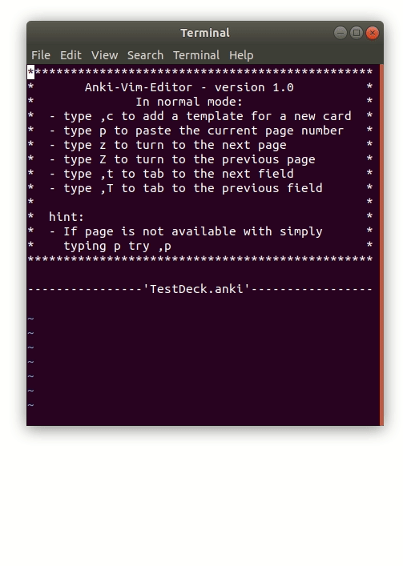
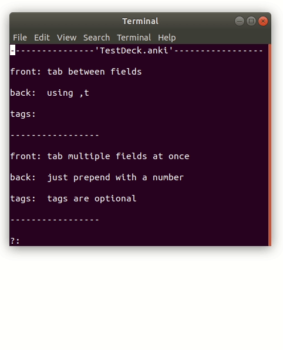

# Anki-Pdf-Editor
Commandline tool to create anki flash cards via the vim editor. Once started the programm will display a selected pdf document in which the user can navigate throughout vim itself. If a anki-card should contain a specific pdf page of the displayed document on either the front- or the backside of a note it can be passed in a simplyfied version where the pagenumber is written between tags. 

All features can be used via shortcuts. For that the program opens a costum [.vimrc](./anki-pdf-editor/src/main/resources/com/dermacon/ankipdfeditor/.vimrc). For further information see the [manual](./otherDocs/manual-tex/manual.pdf).

## Shortcut overview

### Programm specific
* `z` / `Z`: turn next / previous page; Copy the current page tag to the default register (accessed via `p`)
* `,c`: Append new card template to anki file
* `,p`: Reload page tag, pastes the current page tag to cursor position
* `,t` / `,T`: tab between fields

### vim default 


## Requirements
* Ankidroid 2.1 (or newer)
* AnkiConnect [addon](https://ankiweb.net/shared/info/2055492159)
* gnome-terminal ([terminal emulation](https://askubuntu.com/questions/684180/how-to-reinstall-gnome-terminal))
* unix os (Vim)

## Usage
* download jar from release tab and execute via `java -jar ./path/to/jar`

### Top-level menu
```
type
  - a to write new cards
  - e to edit project properties
  - w to push to anki connect
  - q to quit without pushing
  - wq to push and exit
  ------------------------
input: 
```

### Create new Card


### Insert page
// todo insert gif

### Tab fields
   

### Edit properties
// todo insert gif

### Todo
* make instructional gifs for readme 
* check if files in anki-pdf-editor are necessary for build (maybe add to .gitignore)
* publish build
* checkstyle

### Reminder
* anki api documentation: [anki-connect](https://foosoft.net/projects/anki-connect/)
* [Blocking queue example](https://www.mkyong.com/java/java-blockingqueue-examples/)
* record screen - `peek`
* stop screenkey - `pkill -f screenkey`
* [session specfic .vimrc](https://superuser.com/questions/489930/using-a-session-specific-vimrc)
* [vim-cheat-sheet](https://www.slideshare.net/alfrescoqa/vivimcheatsheetpdf)

