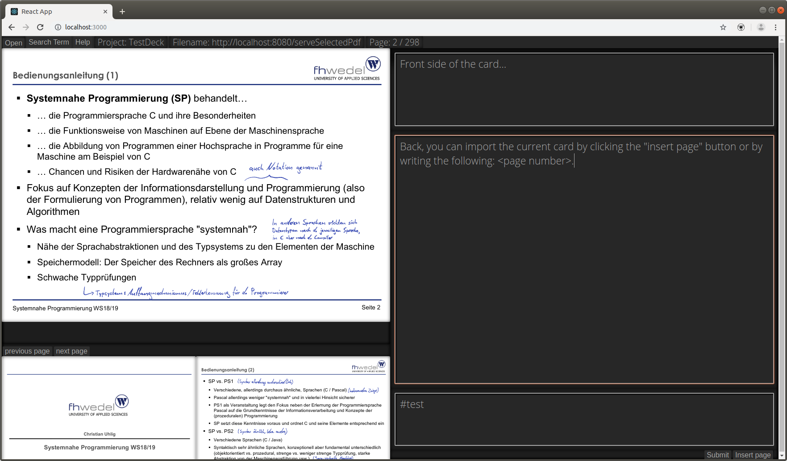

# Anki-Pdf-Editor
This webapp displays a pdf-reader containing an editor to create digital index cards. These cards can then be reviewed with the open source program [ankidroid](https://apps.ankiweb.net/). The whole purpose of this project was to design a more efficient workflow for creating those cards, since it always took quite some time to screenshot the required parts of the pdf document. To solve this issue I implemented a button / shortcut to directly copy the current page displayed in the pdf-viewer to the card. 

## Project structure
Two main projects: 
* `anki-pdf`: Front-end react project displaying the editor components. Server runs on `http://localhost:3000/`.
* `anki-api-connector`: Spring boot rest api as the back-end for the webapp. Server runs on `http://localhost:8080/`.

## Screenshot

## Todo - Front-end
### near-term
* implement page insert at cursor pos
* implement menu
* fix responsive css

### long-term
* implement pdf search
* make components resizable
* frame to big for window
* set uniform margin

